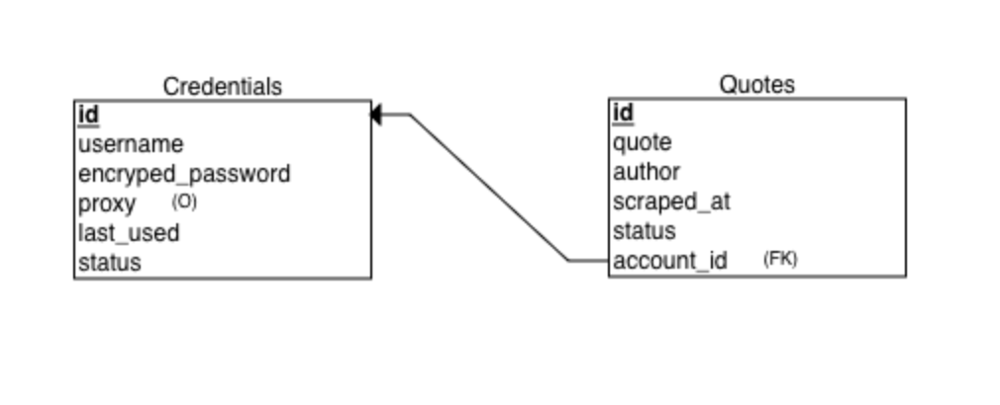

# 🙋🏼‍♂️🙋🏽‍♂️🙋🏽‍♀️ Multi Account Scraper 

## Overview
Hello, Welcome to this README file! In this project, I wanted to demonstrate how I can create a webscraper that uses user info to log in to a website, scrape information, and store it efficiency in an SQL database. Security is priority, so I implement measures to encyrpt passwords and create a system to safely auto update the databases for reusability and longetivity.

This project is mean't to be an example of what a basic ETL workflow can look like. So for this I will be using a simple site for our scraping. I've chosen https://quotes.toscrape.com/login. We will be using user info to login to this site, scrape a quote and its author, and save it to a table in our database.


### ⚙️ Tool/Library Stack:

**Data Storage:** pandas, sqlite3

**Encyrption and Security:**: Cryptography Fernet

**Web Scraping**: Beautiful Soup (I use the lxml parser over html.parser), Playwright (async version)

**Supporting Libaries**: os, datetime, time, asyncio, random

### 📂 File Structure

```
MULTI_ACCOUNT_SCRAPER/
├── credentials/
│   ├── credentials.xlsx
│   └── key.key
│
├── database/
│   └── scraper.db
│
├── database_scripts/
│   ├── add_credentials.ipynb
│   ├── generate_key.ipynb
│   ├── get_credentials.ipynb
│   ├── init_accounts_table.ipynb
│   ├── init_quotes_table.ipynb
│   └── view_scraper_db.ipynb
│
├── scraper_scripts/
│   ├── __pycache__/
│   ├── get_credentials.py
│   └── scraper.ipynb
│
├── README.md
└── Schema.png
```

*NOTE: The files can be stored multiple ways, this is just the way I thought to do it at first* 

## Part 1: Scripts to Initialize the SQL Database

Before we dive into web scraping, we need a secure way to store account data. Otherwise, we’re basically handing out usernames and passwords. Not ideal.

For this, I went with sqlite3, the most beginner-friendly SQL library in Python. It lets you work with an actual SQL database inside Python, without needing to set up anything external. It’s great for small projects or if you’re just learning, like me! But for bigger, more professional setups, I’d definitely swap this out for something like SQLAlchemy, which plays nicely with more robust databases like PostgreSQL or MySQL. From what I can tell, syntax is similar across SQL libraries.

Now, let’s talk security. Storing raw usernames and passwords in a database is a terrible idea — like leaving your front door wide open. (I mean i'll be honest, I'm definetly guilty of this.) If someone gets access to that file, they’ve basically got a master key to everything. So to protect sensitive info (especially in a real-world setting), we need to encrypt it. For that, we’re using the cryptography library in Python.

Using the Fernet class from cryptography, we can generate a unique encryption key. This key — which comes in byte form — is what we’ll use to lock and unlock passwords. We generate it using the **generate_key.ipynb** script and save it in a file called **key.key**. This file stores the key in byte format by default, which is perfect, because Fernet saves everything in byte strings.

For this educational project, I’ll push the **key.key** file to GitHub so you can follow along — but in a real app, this file should be kept secure.

Alright, with encryption in place, we’re ready to actually store stuff. First up: user credentials. We initialize the accounts table using **init_accounts_table.ipynb**, which creates a table in our **scraper.db** database (yep, that’s the name I picked). This table will securely store usernames and passwords (encrypted, of course).

Cool. We’ve got a table for users — but what about the quotes we’re scraping?

For that, we can just create another table. This is done in our **init_quotes_table.ipynb**. It works just like the accounts table — same database, different table. Here's a visual of how the whole database is structured:

**Schema:**



(I'll explain all the columns later don't worry!)

Phew. That was a lot. So far, we’ve:

1. Created a database
2. Made an accounts table (with encryption!)
3. Made a quotes table for our scraped content

This is the skeleton of our system.

Next, we need a way to actually get user data into the accounts table. That’s where **add_credentials.ipynb** comes in. I built it with a scenario in mind: a client sends over an Excel file full of usernames and passwords, and I need to import that into the database. So I use pandas to convert the Excel file, loop through each row, and load it into the accounts table.

Finally, we need a way to grab those credentials when our scraper runs. That’s handled by **get_credentials.ipynb**, which pulls the necessary info from the accounts table and returns it as a dictionary — perfect for plugging right into our web scraping script. I originally made this as an .ipynb script, mostly for testing and jotting down notes — it includes multiple ways to pull credentials along with some markdown explanations. But the actual script our scraper uses is get_credentials.py which will pull info based on our unique id (primary key). We need it as a .py file so we can import it directly into our main scraper script.

And that’s it — we now have a clean, secure way to inject and pull user info from our database in exactly the format we need.

## Part 2: The Web Scraper

Now we need to actually scrape our quotes!

To do this we have one master .ipynb notebook: **scraper.ipynb**. 

Originally, I designed this scraper to run asynchronously. I’ve been using a lot of async functions with Playwright lately because they allow for faster, more efficient scraping — so I figured I’d try applying that same logic here.

Buuut... I ran into a problem: sqlite3 doesn’t play well with multiple async tasks injecting data at the same time. It’s prone to locking and can get fussy when accessed concurrently — not ideal for a scraper running multiple tasks in parallel. So I ended up stripping out the async logic for database writes. That said, the overall structure of the scraper is still written in an async style — even though, for this project, it’s effectively running like a synchronous script.

With that in mind, I’ve broken the scraper into three main parts (Unfortunetly from here, it gets a bit more technical. Bear with me!):

---

1. **Initializing Context for the Playwright Browser Instance**

Since this is a browser-based scrape, we need to first launch a Playwright browser and create a context. This is where we plug in the proxy assigned to each user (I’m using the same user agent for each scrape here, but normally you'd want to rotate both for higher-security sites). 

I won’t get too deep into the details just yet — just know that this function returns two things: context and browser, which we’ll use in the next steps.

---

2. **Our Main Scraper Logic: Scrapes 1 Page**

This next function is where the main scraping logic lives. It’s the heart of the whole operation — the function that uses our user credentials to log into the site, scrape a quote, and then insert that info into our database.

Let’s break it down a bit:

- The function takes in a few key inputs: the Playwright instance (p), the target URL, the username, password, proxy, account_id and status.
    - If you look back at our accounts table, you'll see all the different columns we’ve set up. This is where we pull the necessary credentials from: everything the scraper needs to log in and get to work!
- It first creates a browser context using the proxy provided (this helps with scraping multiple accounts or rotating IPs) from our previous function (create_context)
- Then, it opens a new page and goes to the target URL.
- Once there, it fills out the login form with the given username and password, clicks the submit button, and waits for the page to load fully.

After login, it waits for a specific div class to appear that contains our quotes (multiple things can be used here to signal the page is ready to be scraped, I just chose the div class). Once that shows up, it scrapes the page content, uses BeautifulSoup to parse it, and randomly selects one of the quote blocks on the page.

From that quote block, it pulls out the actual quote text and the author — both of which will get saved to our quotes table.

If anything goes wrong during this process (bad credentials, page load fails, missing selectors, etc.), the function catches the error, logs it, and sets placeholder values so we still know something was attempted.

Finally — and this part is important — it inserts everything into our SQLite database:

- It adds a new row to the quotes table with the quote, author, timestamp, status (like “active” or “error”), and the associated account ID (our foreign key that references the primary key in our accounts table).
- It also updates the accounts table to mark when this account was last used. That’s what the last_used column is for — just a way to track account activity.

---

3. **Our Run Scraper Function**

This final function ties everything together. It pulls a user account from the database using the get_account function (defined in get_credentials.py), and passes the relevant credentials into our scrape_page function.

To initiate a scrape for a specific account, you simply run this function with the desired id, which corresponds to the user’s record in the accounts table of our database.


